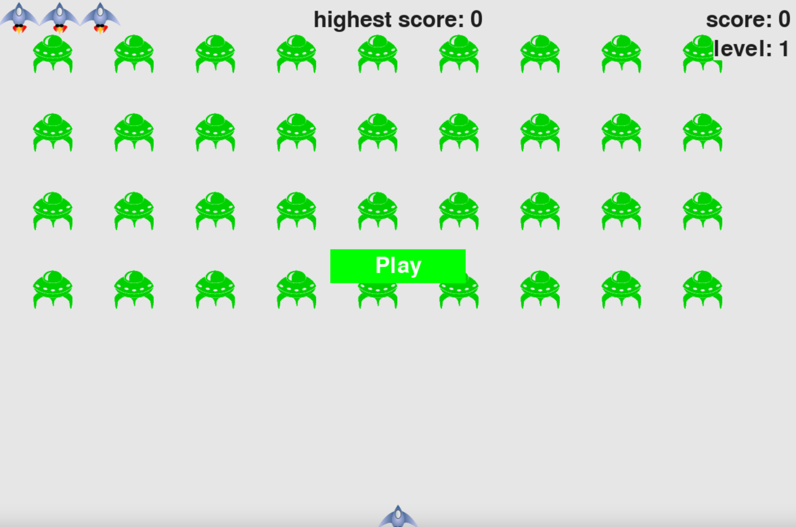

### 👽

It is a Project from Python crash course

### 🚀 Rule:
In Alien Invasion, the player controls a ship that appears at the bottom center of the screen. The player can move the ship right and left using the arrow keys and shoot bullets using the spacebar. When the game begins, a fleet of aliens fills the sky and moves across and down the screen. The player shoots and destroys the aliens. If the player shoots all the aliens, a new fleet appears that moves faster than the previous fleet. If any alien hits the player's ship or reaches the bottom of the screen, the player loses a ship. If the player loses three ships, the game ends.

The number in the middle is highest scores.

When the entire fleet of aliens is destroyed, level will be increased by 1.

### Requeriments: 
- Python 3.0+ 
- Pygame

### How To Play: 
#### Cloning the Repository
```
git clone https://github.com/YiranXu/Alien_Invasion_game
cd Alien_Invasion_game
```
#### Running
```
python invasion.py
```

### Controls:
click 'Play' button or press 'P' to play.

-space bar: shoot

-Arrow keys (left / right/ up/ down): move the ship left/ right /up / down


